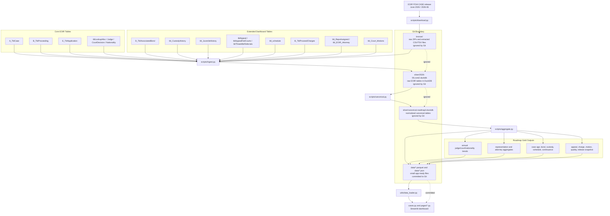

# Pipeline Diagram

[Back to README](../README.md)

This Mermaid diagram shows the current EOIR data flow from local download to the deployed Streamlit app.

## Short Version

- `bronze/` is raw EOIR data and stays local.
- `silver/` is DuckDB build output and stays local.
- `data/` is the small generated app data and is committed.
- Streamlit reads only `data/` at runtime, so deploys are fast.
